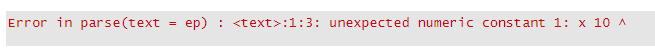
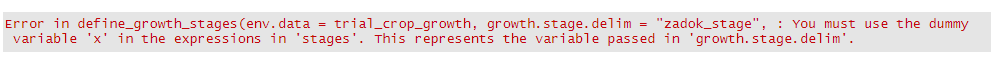

```{r, include = FALSE}
knitr::opts_chunk$set(
  collapse = TRUE,
  eval = FALSE,
  comment = "#>"
)

# Other packages for this vignette
library(dplyr)
library(tidyr)
```


# Introduction

In plant breeding, separating the effect of environment from genetics is crucial for more accurately selecting superior individual. Traditionally, environment is treated as a nuisance factor; however, identifying the specific components of an environment - namely weather, climate, or soil - that impact plants would be useful for improving selection or predicting crop performance. The `envirotyping` package is meant to simplify the process of gathering this explicit environmental data for routine plant breeding analyses.

## Definitions

Before proceeding, it might be useful to lay out some definitions of terms used throughout the workflow.

| Term        | Definition                    |
|-------------|-------------------------------|
| environment | A specific combination of space and time (e.g. Saint Paul, MN in 2019); this can also be specific growing conditions (e.g. high nitrogen vs. low nitrogen) |
| trial | An experiment conducted in a single environment (may be used interchangeably with "environment"). |
| location | A specific geographic point |
| genotype | A genetically unique individual or line |
| environmental covariable | A variable the describes a specific condition within an environment; this could be, for instance, the soil pH at a location, the average temperature during a specific growth stage, etc.) |


## This workflow

This workflow will demonstrate the use of the package for obtaining environmental data that can be used in a quantitative genetic analysis. Figure 1 outlines a diagram of this workflow and what functions should be used.

The first thing you need to do is load the package:

```{r setup}
library(envirotyping)
```


## Data assumptions and examples

This workflow assumes that you have some specific information on environmental metadata, crop phenotypes, and genomic information; however, not all of this information is necessary for using functions in the `envirotyping` package. The table below outlines different data type and whether they are necessary for this workflow or for general use of the package.


| Data type        | Description                   | Required for general use? | Required for this workflow? |
|------------------|-------------------------------|:-------------------------:|:---------------------------:|
| environmental metadata | Data describing a specific environment or trial (e.g. geographic coordinates, planting date, etc.) | X | X |
| phenotypic data | Measurements of the performance of genotypes in a specific environment or environments for one or more traits |  | X |
| genomic data | Genomewide marker data for the genotypes |  | X |


The `envirotyping` package includes some sample data for demonstration in this workflow. These data are available when the package is loaded. [See this page](https://pages.github.umn.edu/neyha001/envirotyping/reference/barley_ex_data.html) for a description of the data.


# Querying weather and soil data

The first step of using `envirotyping` is to obtain weather and soil data for the trials or environments of interest.

## Get daily weather data

Weather data is available as daily measurements from many sources. The Daymet database from NASA is a reliable source for high-resolution data. The `get_weather_data()` function queries this database using trial metadata (provided here in the `trial_info` object). This object must contain the trial name ("trial"), "year", "latitude", and "longitude".

```{r get.daily.weather}
# Retrieve daily weather observations in the same years as the trials
daily_weather <- get_weather_data(trial.info = trial_info)
```

The output of this function is a `tibble` with all of the information from `trial_info`, but with a new column called `"data"` that is a list containing data frames of daily weather observations.


## Get soil data

The `get_soil_data()` function queries the [Harmonized World Soil Database (HWSD)](http://www.fao.org/soils-portal/soil-survey/soil-maps-and-databases/harmonized-world-soil-database-v12/en/) to gather information on soil texture (% silt, sand, clay), organic matter, pH, bulk density, etc at each trial. To use this function, you must provide a path to the `hwsd.bil` file (which should be in a folder with other HWSD raster files). These files can be obtained from the link above and by navigating to "HWSD Raster" by the "Download" section.

Once you have a path to `hwsd.bil` file, you can pass that path to the `get_soil_data()` function:

```{r get.soil}
# Path to the HWSD raster folder with hwsd.bil
hwsd_path <- "path/to/hwsd.bil"

# Retrieve soil data for each location
soil_data <- get_soil_data(trial.info = trial_info, hwsd.path = hwsd_path)
```


Just like the `get_weather_data()` function, the output of this function is a `tibble` with all of the information from `trial_info`, but with a new column called `"data"` that is a list containing data frames of the soil data.


## Get historical weather data

If you would like to model the impact of a location using long-term historical data, you can use the `get_historical_weather_data()` function to obtain daily weather measurements for a range of years at each of many locations:

```{r get.historical .weather}
# Distinct set of location info
location_info <- dplyr::distinct(trial_info, location, latitude, longitude)

# Retrieve 5 years of historical daily weather observations
historical_daily_weather <- get_historical_weather_data(
  location.info = location_info, start.year = 2010, end.year = 2014
)
```

> Note that the Daymet database [only contains daily weather data going back to 1980](https://daymet.ornl.gov/overview).


## Make edits to weather or soil data

Sometimes, you might have external data to complement or replace the weather data obtained by `get_weather_data()`. For example, say you have obtained precipitation data, but want to add known irrigation applications on certain dates in a specific trial. You can use the `edit_environmental_data()` function to append or replace specific weather observation using a supplementary data object. In the example below, irrigation data is added to the precipitation observations (i.e. "rain") from a single trial:

```{r edit.weather}
# Modify the trial irrigation data to set irrigated water as "rain"
trial_irrigation_data$rain <- trial_irrigation_data$irrigation_mm

# Edit the trial weather data with this irrigation information
daily_weather1 <- edit_environmental_data(env.data = daily_weather, suppl.data = trial_irrigation_data,
                                          operation = c("rain" = "+"))

```


# Reducing data dimensionality by summarizing over crop growth stages

Daily weather observations are not very useful for statistical modeling, since there are likely many more explanatory variables than observations (i.e. a big *p*, small *n* problem). Further, daily weather may not be particularly relevant for crops planted at different dates. One way to reduce the dimensionality of this data and incorporate some prior biological is by summarizing environmental data according to known or predicted crop growth stages.

The steps below show how one can use a process-based crop model simulator to predict growth stages for summarizing data.

## Running a crop model

The specific timing of crop growth stages may be recorded during the course of a trial, but often this information is not available. An alternative is to use the daily weather conditions to predict the timing of specific growth stages. This might be done using a simple growing degree day model or more complex process-based simulators such as [APSIM](https://www.apsim.info/) or [DSSAT](https://dssat.net/). 

The `envirotyping` package includes a function, `run_apsim_crop_model()`, for running APSIM simulations. To support this function, the package is also distributed with an example `.apsimx` file for running a barley crop simulation (more examples are forthcoming). You may specify your own base crop model file using the `base.model.path` argument. This base model will be modified using the planting date information and weather data provided in the `env.data` argument.

```{r run.crop.model}
# Run a crop model for each trial
trial_crop_growth <- run_apsim_crop_model(env.data = daily_weather1, base.model.path = "barley")
```

The output of this function is quite similar to the input, `daily_weather`, but the elements of the `data` list have been edited to include the output of the crop growth model.


## Define growth stages 

The output of the barley crop model in the example above includes a continuous variable called `zadok_stage`, which defines the numeric growth stage according to the Zadoks scale. This information can be used to delineate the beginning and ending of discrete growth stages, during which environmental data will be summarized.

The `define_growth_stages()` function uses inequality expressions to define the span of specific growth stages. This requires some prior understanding of what numeric crop developmental information corresponds to what discrete growth stages. An example for barley is provided below:

```{r define.growth.stages}
# Create a list of growth stages delineated by a variable "x"
barley_stages <- list(
 early_vegetative = "x >= 10 & x <= 30", 
 late_vegetative = "x > 30 & x <= 50",
 flowering = "x > 50 & x <= 70", 
 grain_fill = "x > 70 & x <= 91"
)

```

Here, `x` refers to whatever numeric variable will be used in the inequality expressions provided in a list (the `barley_stages` object above). The name of this variable is passed using the `growth.stage.delim` argument in the `define_growth_stages()` function. An example is below:


```{r define.growth.stages2}
# Use these delineations to mark growth stages from the crop model
trial_crop_stages <- define_growth_stages(
  env.data = trial_crop_growth, 
  growth.stage.delim = "zadok", 
  stages = barley_stages
)

```

```{r define.growth.stages.alt}

daily_weather2 <- daily_weather1 %>% 
  mutate(planting_date_yday = lubridate::yday(planting_date), 
         data = purrr::map2(data, planting_date_yday, ~mutate(.x, dap = yday - .y)))


# Create a list of growth stages delineated by a variable "x"
barley_stages <- list(
 early_vegetative = "x >= 10 & x <= 30", 
 late_vegetative = "x > 30 & x <= 50",
 flowering = "x > 50 & x <= 70", 
 grain_fill = "x > 70 & x <= 91"
)


trial_crop_stages <- define_growth_stages(
  env.data = daily_weather2, 
  growth.stage.delim = "dap", 
  stages = barley_stages
)


```


The output of this function again resembles the input (`trial_crop_growth`) or the output of the `get_weather_data()` or `get_soil_data()` functions. Again, the elements of the `data` list have been edited to include another column (`growth_stage`) that adds the discrete growth stages passed in the `stages` argument.

The elements of the list passed in the `stages` argument must be characters that define inequality expressions. Here is what happens when those elements cannot be parsed as expressions: 

```{r define.growth.stages3}
# The early_vegatative element is not an expression
stages <- list(
 early_vegetative = "x 10 & x <= 30", late_vegetative = "x > 30 & x <= 50",
 flowering = "x >  50 & x <= 70", grain_fill = "x > 70 & x <= 91"
)

# Use these delineations to mark growth stages from the crop model
define_growth_stages(
  env.data = trial_crop_growth, 
  growth.stage.delim = "zadok", 
  stages = stages
)

```



Additionally, the use of the dummy variable `x` is required. The function will automatically convert this dummy to whatever variable is passed in the `growth.stage.delim` argument. Here is what happens when `x` is not included in the list of expressions:


```{r define.growth.stages4}
# This list uses the variable name to be passes in growth.stage.delim
stages <- list(
 early_vegetative = "zadok 10 & zadok <= 30", 
 late_vegetative = "zadok > 30 & zadok <= 50",
 flowering = "zadok >  50 & zadok <= 70", 
 grain_fill = "zadok > 70 & zadok <= 91"
)

# Use these delineations to mark growth stages from the crop model
define_growth_stages(
  env.data = trial_crop_growth, 
  growth.stage.delim = "zadok_stage", 
  stages = stages
)

```



## Summarize weather data according to growth stages

Once discrete growth stages are assigned, the next step is to summarize the daily weather observations within each of those stage. The `summarize_environmental_data()` function provides a simple way to calculate these summaries. 

The most important argument to this function is `.funs`, which allows the user to provide variable-specific summary functions. For instance, growing degree days are usually expressed as an accumulated value (a cumulative sum), while temperature might be summarized as an arithmetic average. `.funs` takes a list of formula-based functions; the names of this list are the variables you wish to summarize. For example, if you wanted to calculate the cumulative rainfall and average maximum temperature during each growth stage, the `.funs` argument would look like this:

```
.funs <- list(rain = ~sum, maxt = ~mean)
```

Any functions that return a single value can be passed.

Below is an example of using the `summarize_environmental_data()` on the daily weather variable with assigned growth stages. The `unite` argument, when set to `TRUE`, combines the growth stage and variable into a single variable and provides a single-row data frame of summarized data. If not switched, the output is a tidy table of growth stage, variable, and value.

```{r summarize.weather.data}
# A list defining how to summarize each variable
summary_funs <- list(rain = ~sum, radn = ~sum, maxt = ~mean, mint = ~mean, daylength = ~mean)

# Summarize environmental data according to the growth stages
trial_data_summarized <- summarize_environmental_data(
  env.data = trial_crop_stages,
  growth.stage.col = "growth_stage",
  .funs = summary_funs,
  unite = TRUE
)

```

You will notice in the output of this function that elements of the `data` list contain only a single row - 1 for each trial - instead of 365 rows for data from each date.


## Repeat these procedures for historical weather data

The same steps can be followed for assigning growth stages to historical daily weather data and summarizing those variables. Unlike the daily weather data collected above, historical weather data might be collected absent any trial that is conducted at a location during the years covered by the historical data. To run a crop model, we therefore need to predict some of the important metadata for a trial that would *theoretically* been conducted at that location in a historical year; namely, the planting date must be determined.

A useful resource for predicting planting dates is the [Crop Calendar Dataset](http://nelson.wisc.edu/sage/data-and-models/crop-calendar-dataset/), which includes historical average planting and harvest date information for several crop species across the world. A convenient CSV file that contains this data can be downloaded from the website linked above, or by running the following code:

```{r download.planting.date.info}
# Download the crop calendar data
url <- "http://nelson.wisc.edu/sage/data-and-models/crop-calendar-dataset/All_data_with_climate.csv"
crop_calendar <- read.csv(url)
```

This will read the crop calendar data into your R environment.

The `predict_historical_planting_dates()` function will use this information along with the historical daily weather data you have obtained to predict the planting date of a specific crop. While the function relies on historical average planting dates, you can tune the function to include heuristics into the planting decision-making. 

For example, the code below will predict planting dates for spring barley, but will search for dates that i) have a mean temperature that is not more than 2 degrees (C) colder than the average planting date temperature; ii) experience a daylength that is not more than 0.5 hours less than the average planting date daylength; iii) had a minimum temperature above 0 degrees (C), and iv) had a maximum rainfall of 0.5 mm (i.e. one usually doesn't plant when it's raining).

```{r planting.date.historical}
# Predict planting dates
historical_daily_weather1 <- predict_historical_planting_dates(
 env.data = historical_daily_weather, 
 crop = "barley - spring",
 crop.calendar = crop_calendar,
 meant.adj = -2, daylen.adj = -0.5,
 mint.lower = 0, rain.upper = 0.5
)

```

The output of this function is a modified version of the `historical_daily_weather` data frame with two new columns: a `closest_location` column that notes the location in the crop calendar the provided the average planting date information, and a `planting_date` column with the predicted planting date.


Once planting dates are known or predicted, the remaining steps are similar to those above. First, crop growth is simulated for each location and year of historical data:

```{r growth.stage.historical1}
# Run a crop model for each historical "trial"
hist_crop_growth <- run_apsim_crop_model(
  env.data = historical_daily_weather1, base.model.path = "barley"
)
```

Next, growth stages are defined:

```{r growth.stage.historical2}
# Define growth stages using the same set of barley stages
hist_crop_stages <- define_growth_stages(
  env.data = hist_crop_growth, 
  growth.stage.delim = "zadok", 
  stages = barley_stages
)
```

Finally, weather data is summarized within each discrete growth stage:

```{r growth.stage.historical3}
# Summarize data using these growth stages
hist_data_summarized <- summarize_environmental_data(
  env.data = hist_crop_stages, 
  .funs = summary_funs,
  unite = TRUE
)

```


# Creating environmental covariable matrices

The final step in making the environmental data useful for modeling or prediction is to create matrices of environmental covariables. These will take the shape of a $n \times p$ matrix, where $n$ indicates the number of environments (or locations) and $p$ indicates the number of covariables.

## Merge sets of environmental data

First, while we have summarized weather data, we need to merge this with the soil data we already collected (but, up until now, have not manipulated). A convenience function, `merge_environmental_data()` allows one to merge different environmental datasets together for the same trials.

Here is an example of merging the summarized daily weather data and the soil data.

```{r merge.trial.data}
# Merge the daily weather data (summarized by growth stage) with the soil data
daily_weather_soil <- merge_environmental_data(trial_data_summarized, soil_data)

```

Note that this function will merge data frames based on any and all common columns. So, you could not merge the daily summarized weather data and the historical summarized weather data, because they do not share trial names:

```{r merge.trial.data1}
# This will produce a data frame with zero rows
merge_environmental_data(trial_data_summarized, hist_data_summarized)

```


However, you can merge the historical summarized weather data with the soil data because they share locations:

```{r merge.historical.data}
# Merge the historical weather data (summarized by growth stage) with the soil data
# This function will merge based on location
hist_weather_soil <- merge_environmental_data(
  hist_data_summarized, 
  dplyr::select(soil_data, location, data)
)
```


## Create an environmental covariable matrix

The output of the `merge_environmental_data()` function are just like its inputs, which include a column called `data` that is a list of data frames. We need to unnest this list of data frames to make it useful. The `tidyr` package provides an easy function to do that:

```{r tidy.daily.data}
# Load the tidyr package
library(tidyr)

# Reshape the data
daily_weather_soil1 <- daily_weather_soil %>% 
  unnest(cols = data) %>% 
  gather(variable, value, c("latitude", "longitude", "elevation", 
                            names(daily_weather_soil$data[[1]])))

```

The output of this code is a data frame in tidy long format, where each line is the value of a single environmental covariable in a single environment or trial (along with all of the relevant metadata for that trial). This data frame can be used for other summary functions or for however you please, but it can also be passed to another function, `ec_matrix()`, that will calculate the $n \times p$ matrix of environmental covariables.

This function simply requires the names of columns that contain the trial names, the names of the environmental covariables, and the value of that covariable. The function automatically will run a few basic quality control steps, including a test for variation (any covariable with no variation is removed) and a test for normality. 

```{r create.daily.ecmat}
# Create a n x p environmental covariable matrix
daily_ecmat <- ec_matrix(env.data = daily_weather_soil1, env.col = "trial", 
                         var.col = "variable", val.col = "value", check.data = TRUE)

```

The output of this function is a `matrix` object of (by default) centered and scaled environmental covariable data.

A similar process can be used for the historical data. However, as the historical data is usually meant to better describe the average effect of a location over time, you will need to summarize the historical environmental covariables across years before creating an environmental covariable matrix.

First, you need to unnest and reshape the historical data just like the daily environmental data:

```{r tidy.hist.data}
# Reshape the data
hist_weather_soil1 <- hist_weather_soil %>% 
  unnest(cols = data) %>% 
  gather(variable, value, c("latitude", "longitude", "elevation", 
                            names(hist_weather_soil$data[[1]])))

```


Next, you can use built-in R functions for summarizing the historical data across years. Suppose from this historical data that spans 2010-2014, you want to summarize across the years 2012-2014. You can use functions like `aggregate()` to summarize the value of each environmental covariable across several years

Here is an example:

```{r summarize.hist.data}
# Calculate the average value of each covariable in each location over a few years
hist_weather_soil_aggregated <- aggregate(value ~ variable + location, data = hist_weather_soil1, 
                                          FUN = mean, subset = year %in% 2012:2014)

```

The `ec_matrix()` function can then be used to produce the environmental covariable matrix:

```{r create.hist.ecmat}
# Create a n x p environmental covariable matrix
hist_ecmat <- ec_matrix(env.data = hist_weather_soil_aggregated, env.col = "location", 
                        var.col = "variable", val.col = "value", check.data = TRUE)

```


# Case study 1: using environmental data in genomic prediction

This case study will examine a example of using the environmental covariable data gathered above. In this example, we will use the environmental covariable data in a unified prediction model that includes genomic information.

We will demonstrate using a Genomic-Best Linear Unbiased Prediction (GBLUP) mixed-effect model:

$$
y_{ij} = \mu + g_i + t_i + (gt)_{ij} + \epsilon_{ij},
$$

where $y_{ij}$ is the mean of the *i*th genotype in the *j*th environment, $\mu$ is the grand mean, $g_i$ is the random effect of the *i*th genotype, $t_i$ is the random effect of the *j*th environment, $(gt)_{ij}$ is the random effect of the *ij*th genotype-environment combination (interaction) and $\epsilon_{ij}$ is error.

The genomic and environmental covariable data will be integrated in covariance matrices that model the random effect $g_i$, $t_i$, and $(gt)_{ij}$. In this case:

+ $g_i \sim N(0, \mathbf{G}\sigma^2_g)$
+ $t_i \sim N(0, \mathbf{E}\sigma^2_g)$
+ $(gt)_{ij} \sim N(0, \mathbf{(G \otimes E})\sigma^2_g)$

$\mathbf{G}$ is a genomic relationship matrix, $\mathbf{E}$ is an environmental "relationship" matrices calculated using environmental covariables, and $\mathbf{(G \otimes E})$ denotes the Kronecker product between those two matrices.


## Creating the environmental "relationship" matrix

The environmental "relationship" matrix (or, more accurately, the covariance matrix) mentioned above is created directly from environmental covariables. This matrix shares some similarity with the genomic relationship matrix: both approximate the covariance between their respective factors (environments or genotypes); however, while there is theory supporting the use of genomic markers to approximate genotypic covariance as a function of degree of relationship (i.e. coefficients of coancestry), no such theory exists for environments. Nevertheless, this does not stop us from using similar formulas to calculate the environmental "relationship" matrix.

The sections below detail different cases in constructing environmental "relationship" matrices.

### Using all available environmental covariables

One option for calculating the "relationship" matrix is to use all available environmental covariables. This method relies on the idea that more measurements of explicit environmental conditions (i.e. weather, soil, etc.) will more closely capture the total unique environmental conditions experienced by the crop, and it is this entirety that determines eventual phenotypic outcomes. This is analogous to using all available genomic markers to model the relationship between genotypes.

Constructing the environmental "relationship" matrix can be accomplished by using the `ec_relmat()` function. If you want to use all possible environmental covariables, simply pass the covariable matrix (i.e. from the `ec_matrix()` function) to this function:

```{r all.ec.relmats}
# Construct a relationship matrix for environments
env_all_relmat <- ec_relmat(ec.matrix = daily_ecmat)

# Construct a relationship matrix for locations using historical data:
loc_all_relmat <- ec_relmat(ec.matrix = hist_ecmat)
```

This function includes other options for weighing different covariables or using different formulas for calculating the relationship matrix. See the help page for this function for more information.


### Selecting important environmental covariables

A different option for calculating the "relationship" matrix is to use known phenotypic observations and a variable selection or feature identification method to determine the most important environmental covariables. This method relies on the idea that certain environmental conditions impact crop phenotypic outcomes, and those are the most useful for prediction.

This package includes a function, `ec_variable_selection()`, that performs variable selection based on linear mixed models and stepwise addition of variables. The function will continue to add variables to a model so long as the performance of the model (measured using cross-validation) continues to improve. This method of stepwise variable selection aims to minimize overfitting and select variables that will be most useful for prediction.

The function requires phenotype data in order to proceed. This must be observations for a single trait measured on (ideally) many genotypes in (ideally) many environments (the same environments for which you should now have explicit covariables). The default variable search method for this function is the linear mixed model, which takes the form:

$$
y_{ij} = \mu + g_i + \sum^P_{p=1}\beta_p x_{jp} + \epsilon_{ij},
$$
where $y_{ij}$, $\mu$, and $g_i$ are the same as defined above, except no relationship matrix is used to model the covariance between genotypes; $\beta_p$ is the regression coefficient of the *p*th covariable, and $x_{jp}$ is the value of the *p*th environmental covariable in the *j*th environment.

Here is an example of using the `ec_variable_selection()` function to determine important environmental covariables:

```{r model.daily.weather}
# Use stepwise regression to determine the important set of environmental
# covariables
variable_selection_out <- ec_variable_selection(
 pheno.data = pheno_data_train, 
 env.data = daily_weather_soil1, 
 env.col = "trial",
 gen.col = "line_name", 
 y.col = "value", 
 var.col = "variable",
 val.col = "value"
)
```

This function returns a list containing the results of the variable selection and the names of the selected covariables. See the help file for this function for more information about its output.

You can then use the names of the selected covariables to subset the full environmental covariable matrix and calculate a "relationship" matrix based only on those covariables:

```{r lm.ec.relmats}
# Subset the environmental covariable matrix based on the results of the 
# variable selection operation
daily_ecmat1 <- subset.matrix(x = daily_ecmat, select = row.names(variable_selection_out$optVariables))

# Create the relationship matrix
env_sel_relmat <- ec_relmat(ec.matrix = daily_ecmat1)
```

### Model historical environmental covariables

A similar variable selection approach can be used to determine the important historical environmental covariables; however, there is an additional variable of time that needs to be considered. Historical environmental data is collected on a per-year basis; this data, intended to model the impact of location, needs to be summarized over years, but the ideal time frame (i.e. number of years) over which to summarize may not be known. 

You can measure this empirically by performing variable selection over different time frames and determining that which maximizes model performance. This capability is provided by the `ec_variable_selection_slide()` function, which extends the `ec_variable_selection()` function over different time frames.

To use this function, you first need to create a list of years that form the time frames of interest. For example, below we create a list of accumulating years and a list of equal number of years across a sliding window:

```{r create.timeframes}
# Create a list of years that accumulate from latest to earliest
timeframe_list <- Reduce(c, sort(unique(hist_weather_soil1$year)), accumulate = TRUE, right = TRUE)

# Create a list of years forming a sliding window of two years
# Use the slider package to create this
window_list <- slider::slide(.x = sort(unique(hist_weather_soil1$year)), .f = c,
                             .after = 1, .step = 1, .complete = TRUE)
# Remove NULL elements
window_list <- subset(window_list, !sapply(window_list, is.null))

```

You will notice that the `timeframe_list` object contains elements of different lengths (i.e. increasing the number of years over which data will be summarized), while the `window_list` object contains elements of equal length.

The `ec_variable_selection_slide()` function can then be used to identify the best time frame.

```{r hist.varsel}
# Add location information to the pheno_data_train object
pheno_data_train1 <- merge(pheno_data_train[-2], trial_info[c("trial", "location")])

# Variable selection using the list of time frames
timeframe_ec_sel <- ec_variable_selection_slide(
  pheno.data = pheno_data_train1, env.data = hist_weather_soil1, 
  env.col = "location", gen.col = "line_name", y.col = "value", 
  var.col = "variable", val.col = "value", time.col = "year", 
  time.list = timeframe_list
)

# Variable selection using the list of sliding windows
window_ec_sel <- ec_variable_selection_slide(
  pheno.data = pheno_data_train1, env.data = hist_weather_soil1, 
  env.col = "location", gen.col = "line_name", y.col = "value", 
  var.col = "variable", val.col = "value", time.col = "year", 
  time.list = window_list
)

```

The results of the time frame selection based on accumulating years (i.e. `timeframe_ec_sel$timeframeFinalCVResults`) indicates that summarizing historical data between 2013 and 2014 was best; based on a sliding window (i.e. `window_ec_sel$timeframeFinalCVResults`), summarizing data between 2011 and 2012 was best. Both results are quite similar (based on root mean squared error), though the sliding window approach results in a slightly lower RMSE.

The `ec_variable_selection_slide()` output includes a environmental covariable matrix with values of all covariables summarized across the optimal time frame. You can then subset this matrix for the covariables that were determined to be most important by the variable selection procedure:

```{r create.hist.ecmat1}
# Extract the historical environmental covariable matrix
hist_ecmat1 <- window_ec_sel$ecMatrixSelected
# Subset for the important covariables
hist_ecmat1 <- subset.matrix(x = hist_ecmat1, select = row.names(window_ec_sel$variableSelectionResults$optVariables))

# Construct a relationship matrix
hist_sel_relmat <- ec_relmat(ec.matrix = hist_ecmat1)
```


## Using environmental "relationship" matrices for genomic prediction

Once the environmental "relationship" matrices are constructed, they can be used in genomic prediction models in the same way that markers are used: model the covariance between (in this case) environments or predict the value of unobserved environments. Below are examples of fitting the model mentioned above using genomic data, environmental data, and their interaction to predict the phenotypes of previously unobserved genotypes in previously unobserved environments.

In both cases, marker data is used to model the covariance between genotypes via a relationship matrix. This matrix is already provided in the package as the data object `Gmat`.

### Predictions in previously unobserved environments

To make predictions in previously unobserved environments, we use the environmental "relationship" matrix created from the in-season weather and soil data (i.e. `env_sel_relmat` in this example). We use the `mmer()` function from the `sommer` package to fit the model and generate predictions:

```{r predict.unobs.env}
# Rename the relationship matrices for consistency
Emat <- env_sel_relmat
Gmat <- Gmat
# The kronecker product models the interaction between the two matrices
GEmat <- kronecker(X = Gmat, Y = Emat, make.dimnames = TRUE)

# Subset phenotype data based on the genotypes that are in the Gmat
pheno_data_train2 <- subset(pheno_data_train1, line_name %in% row.names(Gmat))
# Add factors for genotypes and environments
pheno_data_train2$line_name <- factor(pheno_data_train2$line_name, levels = row.names(Gmat))
pheno_data_train2$trial <- factor(pheno_data_train2$trial, levels = row.names(Emat))
# Add a factor for interactions
pheno_data_train2$gxe <- interaction(pheno_data_train2$line_name, pheno_data_train2$trial, sep = ":")

# Train the model using sommer
library(sommer)
model_train <- mmer(
  fixed = value ~ 1,
  random = ~ vs(line_name, Gu = Gmat) + vs(trial, Gu = Emat) + vs(gxe, Gu = GEmat),
  data = pheno_data_train2,
  verbose = FALSE
)

```


After the model is fit, use a separate data frame of targets to generate the predictions. Below we use the data object `pheno_data_test` to validate predictions.

```{r gen.pred}
# Add the same levels to factors in pheno_data_target
pheno_data_test1 <- subset(pheno_data_test, line_name %in% row.names(Gmat))
pheno_data_test1$line_name <- factor(pheno_data_test1$line_name, levels = levels(pheno_data_train2$line_name))
pheno_data_test1$trial <- factor(pheno_data_test1$trial, levels = levels(pheno_data_train2$trial))
# Add a factor for interactions
pheno_data_test1$gxe <- interaction(pheno_data_test1$line_name, pheno_data_test1$trial, sep = ":")


## Retrieve the predicted values
# Grand mean
mu <- model_train$Beta$Estimate

# Genotypes
Z_genotypes <- model.matrix(~ 0 + line_name, pheno_data_test1)
u_genotypes <- as.matrix(model_train$U$`u:line_name`$value)
# Environments
Z_environments <- model.matrix(~ 0 + trial, pheno_data_test1)
u_environments <- as.matrix(model_train$U$`u:trial`$value)
# GxE
Z_gxe <- model.matrix(~ 0 + gxe, pheno_data_test1)
u_gxe <- as.matrix(model_train$U$`u:gxe`$value)

# Generate predictions
pred_vals <- mu + (Z_genotypes %*% u_genotypes) + (Z_environments %*% u_environments) + (Z_gxe %*% u_gxe)

# Add the predicted values to the data.frame
pheno_data_test1$predValues <- pred_vals[,1]

# Measure the model performance by calculating the root mean squared error
# and correlation between predicted and observed phenotypes
library(dplyr)
pheno_data_test1 %>%
  group_by(trial) %>%
  summarize(accuracy = cor(value, predValues),
            RMSE = sqrt(mean((value - predValues)^2)))

```


You should obtain the following measures of prediction accuracy (i.e., the correlation) and root mean squared error:

| trial | accuracy | RMSE |
|:------|:----------:|:------:|
|2015_S2C1F4_BZ15 | 0.121 | 2828 |
|S2_MET_CPE16 | 0.325 | 397.1 |


